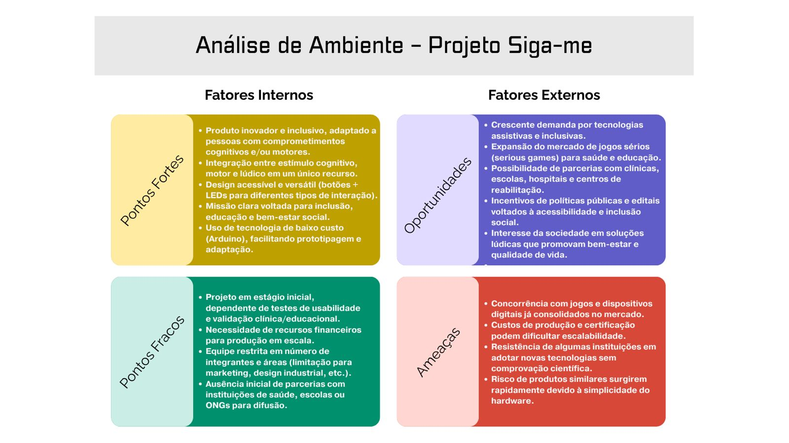

# Investimentos

| Fixo           | Valor (R$)     |
|----------------|----------------|
| Armários       | 300,00         |
| Computadores   | 4x1500,00      |
| Impressora     | 1200,00        |
| Prateleiras    | 2x200,00       |

| Pré-Operacional             | Valor (R$)     |
|-----------------------------|----------------|
| Marketing para Inauguração  | 2000,00        |
| Taxas e Licenças            | 1000,00        |
| Criação e Registro da Marca | 500,00         |
| Software para Gestão        | 500,00         |

# Capital de Giro
- Aproximadamente R$150.000
- Prazo médio de estoque: 30 dias.
- Prazo médio de recebimento: 90, 150 e 300 dias.
- Prazo médio de pagamento: 60 dias.

# Estratégia de Precificação

## Valor Entregue
- **Benefícios ao cliente**:  
  - Estímulo da memória, coordenação motora e velocidade de resposta.  
  - Inclusão de pessoas com comprometimentos cognitivos e/ou motores em atividades lúdicas.  
  - Ferramenta terapêutica e educacional para clientes finais, clínicas, escolas e instituições de reabilitação.  
  - Diferencial competitivo: design adaptado e acessível, com dois modos de operação (automático e manual).  
  - Melhora no bem-estar, qualidade de vida e experiência de aprendizado.  

## Capacidade de Pagamento
- Capacidade média de pagamento: entre **R$ 500,00 e R$ 2000,00** por unidade.
- Mesa mais simples para uso doméstico: entre **R$ 500,00 e R$ 800,00**
- Mesa mais elaborada, com todas as funcionalidades, incluindo modo manual e relatórios: **R$ 800,00 e R$ 2000,00**

## Modelo de Precificação
- **Venda única de produto físico:**  
  - **Versão Simples (R$ 700,00)**: voltada para o uso doméstico.
  - **Versão Profissional (R$ 1500,00)**: voltada para clínicas e instituições, com o modo manual incluso, maior robustez, relatórios de desempenho e garantia estendida.  
- Possibilidade de oferecer **serviços complementares**:  
  - Manutenção anual (R$ 300).  
  - Atualizações de software e customizações (sob demanda).  

## Periodicidade
- Produto vendido como **compra única** (hardware + software).  
- Serviços complementares com cobrança **anual** (manutenção, atualizações, suporte técnico).  

## Métricas
- **CAC (Custo de Aquisição de Cliente):** estimado em R$ 400,00 (eventos, feiras de educação e saúde, marketing digital segmentado).  
- **ARPU (Receita Média por Cliente):** ~R$ 2.200,00 considerando venda da mesa + parte dos serviços complementares.  
- **LTV (Lifetime Value):** ~R$ 3.400,00 (considerando recompra de versões atualizadas + serviços ao longo de 3 anos).

# Enquadramento Jurídico e Tributário

## Natureza Jurídica
- **Sociedade Limitada (LTDA)**  
  - Forma societária escolhida, pois permite a atuação em grupo (mais de um sócio) com responsabilidade limitada ao capital social.  
  - Protege o patrimônio pessoal dos sócios em caso de dívidas da empresa.  
  - Possibilita maior credibilidade perante fornecedores, investidores e clientes institucionais (clínicas, escolas, hospitais).  

## Regime Tributário
- **Simples Nacional** (faixa inicial até R$ 4,8 milhões/ano)  
  - Justificativa: regime simplificado que unifica tributos federais, estaduais e municipais em guia única (DAS).  
  - Menor carga tributária no início, com alíquotas progressivas a partir de 6%.  
  - Reduz burocracia e custos contábeis, ideal para startups e empresas em fase inicial.  

## Tributação Incidente
Dependendo da operação (fabricação e venda de bens físicos + serviços complementares de manutenção/atualização):

- **IRPJ (Imposto de Renda Pessoa Jurídica)**  
- **CSLL (Contribuição Social sobre Lucro Líquido)**  
- **PIS e COFINS** (tributos sobre faturamento, já incluídos no Simples Nacional)  
- **ICMS** (Imposto sobre Circulação de Mercadorias e Serviços – aplicável à venda do produto físico)  
- **ISS** (Imposto sobre Serviços – aplicável à prestação de manutenção, suporte ou customização de software)  
- **INSS Patronal** (contribuições previdenciárias sobre a folha de pagamento, com redução no Simples)  

## Obrigações Acessórias
- **Emissão de Notas Fiscais Eletrônicas (NF-e e NFS-e)** para vendas de produtos e serviços.  
- **Declaração Anual do Simples Nacional (DASN-SIMEI ou PGDAS-D)**.  
- **Registro contábil simplificado** (livros caixa, relatórios de receitas/despesas).  
- **Declarações trabalhistas** (eSocial, GFIP, RAIS, quando houver empregados).  
- **Obrigações estaduais/municipais**: cadastro na SEFAZ (para ICMS) e prefeitura (para ISS).

# Estrutura Empresarial - Sigame Industria LTDA

## Natureza Jurídica

Simples Nacional LTDA

## Nome Empresarial

Sigame Industria LTDA

## Capital Social

- **Capital inicial:** R$300.000,00
- **Distribuição:** 33% das cotas equivalentes a R$100.000,00 para cada sócio

## Tributos Incidentes

- Simples nacional iniciando em 4,5% do faturamento
- Diferencial de Alíquotas (DIFAL) em média 6% do valor de compras dos materiais

## Impostos e Contribuições Trabalhistas

- FGTS (8%) = 1630 × 8% = 130,4
- INSS do funcionário (7,5% a 14% descontado do salário)

## Taxas e Obrigações

- Sindical Patronal (média R$ 100 a R$ 500 por ano, varia por categoria)
- Alvará de funcionamento municipal (R$ 50 a R$ 300, varia por cidade)
- Taxa de licença/localização (R$ 30 a R$ 200, varia por município)

## Obrigações Fiscais e Contábeis

### Obrigações Mensais

- DAS - Documento de Arrecadação do Simples Nacional (até dia 20)
- DEFIS - Declaração de Faturamento (mensalmente)
- eSocial - eventos trabalhistas e folha de pagamento
- SEFIP - recolhimento do FGTS (até dia 7)

### Obrigações Anuais

- DASN-SIMEI - Declaração Anual do Simples Nacional (até 31/maio)
- RAIS - Relação Anual de Informações Sociais (até março)

### Obrigações Contábeis

- Escrituração contábil completa (Livro Diário e Razão)
- Balanço Patrimonial e DRE anuais
- Controle de estoque (entrada/saída de materiais)
- Arquivo digital dos documentos fiscais por 5 anos​​​​​​​​​​​​​​​​

# Análise de Ambientes

## Concorrência
- **Jogo Genius Original:** aproximadamente R$ 300, porém sem recursos adaptados para inclusão. [https://www.estrela.com.br/jogo-genius-estrela/p?srsltid=AfmBOooA6o4Iuz3WfushvJGaiv7foGz1wJf04dabGGGMIi53i2aGKkfj]
- **Produtos terapêuticos e mesas interativas importadas:** podem variar de R$ 4.000 a R$ 15.000, com foco em clínicas especializadas (Neurolevel Sensory Table, RemindMeCare Touch Tables, Touch2Play).
- **Diferencial Siga-me:** preço mais acessível que soluções internacionais, adaptado à realidade brasileira, design inclusivo, acessibilidade física e cognitiva, suporte em português.

## Matriz SWOT

## Análise Detalhada do Fluxo de Caixa (Projeção 24 Meses)

**Sigame Industria LTDA**

### 1. Desempenho Operacional e Crescimento (Métricas)

A projeção demonstra uma estratégia de crescimento sustentado, com um Preço Médio de Venda (ASP) assumido de R$ 1.100,00 e um CMV (Custo da Mercadoria Vendida) fixo em 30% do faturamento.
O crescimento das vendas de 5% a.m. (no primeiro ano) e 3% a.m. (no segundo ano) indica que a empresa alcança um volume de **42 unidades vendidas** e **R$ 46.200,00 em faturamento mensal** ao final do período de 2 anos.

### 2. Gestão de Caixa e Ponto de Equilíbrio

O principal desafio da Sigame Industria LTDA reside na gestão do ciclo financeiro, dominado pelo longo **Prazo Médio de Recebimento (PMR)** (90/150/300 dias), em contraste com o prazo de pagamento do CMV de 60 dias.

#### Queima de Caixa e Saldo Acumulado

* **Saldo Inicial:** O Capital Social robusto de **R$ 300.000,00** é essencial, pois financia a operação durante a fase de maturação do ciclo financeiro.

* **Queima de Caixa:** Nos primeiros 10 meses de operação (Mês 1 a Mês 10), a empresa apresenta **Saldo do Mês (A - B) consistentemente negativo**. Isso ocorre porque as despesas e custos fixos são pagos à vista ou em curto prazo (Mês 1: **-R$ 27.760,20**), enquanto as receitas levam 3 a 10 meses para entrar (PMR).

* **Ponto de Equilíbrio Operacional de Caixa (Cash Flow Break-Even):** O saldo do mês se torna positivo pela primeira vez no **Mês 11 (Novembro/2026)** com um superávit de **R$ 542,93**. Este é o mês em que as entradas de vendas acumuladas finalmente superam as saídas operacionais mensais.

* **Mínimo Histórico:** O Saldo Acumulado atinge seu ponto mais baixo no **Mês 10 (Outubro/2026)**, registrando **R$ 184.844,22**. Isso representa uma utilização de **R$ 115.155,78** do Capital Social para financiar o capital de giro (equivalente a 38% do capital inicial).

#### Evolução do Saldo

A partir do Mês 11, com a entrada das parcelas maiores de vendas (principalmente as recebidas a 90 e 150 dias dos primeiros meses de crescimento), o saldo do mês se mantém positivo e crescente.

* **Saldo Acumulado Final (Mês 24):** A empresa encerra o segundo ano com um Saldo Acumulado robusto de **R$ 265.217,37**, provando a viabilidade do modelo de negócio no longo prazo, desde que o crescimento das vendas se mantenha.

### 3. Considerações Finais e Riscos

O principal risco do projeto é a **liquidez de curto prazo** devido à incompatibilidade entre o PMR longo e as saídas operacionais. O Capital Social de R$ 300.000,00 está bem dimensionado, pois consegue cobrir o pico máximo de necessidade de caixa (R$ 115 mil) e manter uma reserva de segurança.

